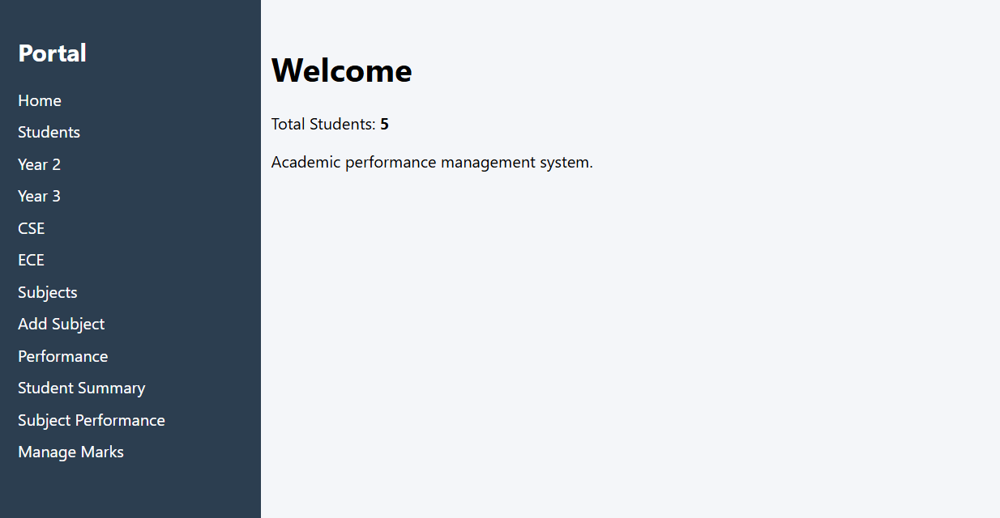
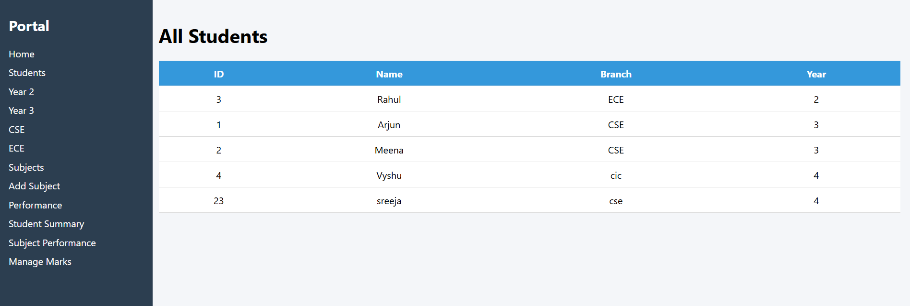
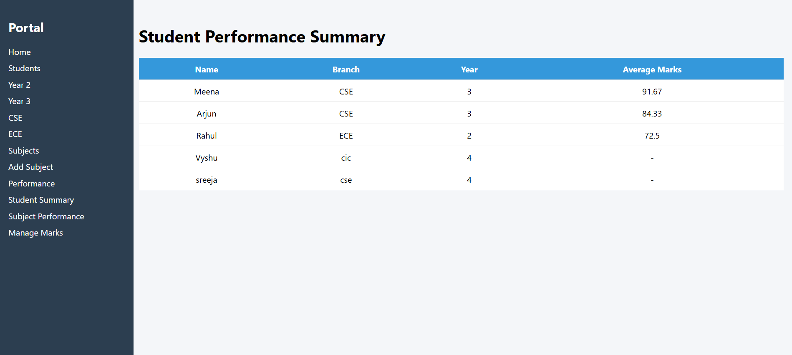
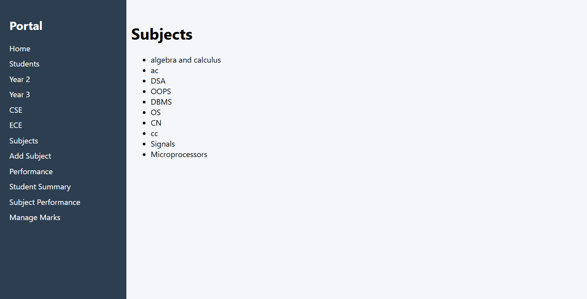

# Student Performance Web Application

A web-based application built using Flask and SQLite to manage student records
and analyze academic performance through a clean dashboard interface.

## 🚀 Features
- Add and manage students with department and academic year
- Assign subjects based on branch and year
- Add and update student marks via web UI
- Student-wise performance summary with average marks
- Subject-wise performance analysis
- Sidebar-based dashboard navigation

## 🛠 Tech Stack
- Python (Flask)
- SQLite
- SQL
- HTML, CSS
- JavaScript (basic)

## 🗄 Database Schema
- **students** (student_id, student_name, department, year)
- **subjects** (subject_id, subject_name, department, year)
- **marks** (student_id, subject_id, marks)

## 📸 Screenshots

### Dashboard


### Students Management


### Student Performance


### Subjects


## ▶ How to Run the Project
```bash
git clone https://github.com/saisreeja6905/student-performance-webapp.git
cd student-performance-webapp
pip install -r requirements.txt
python app.py


